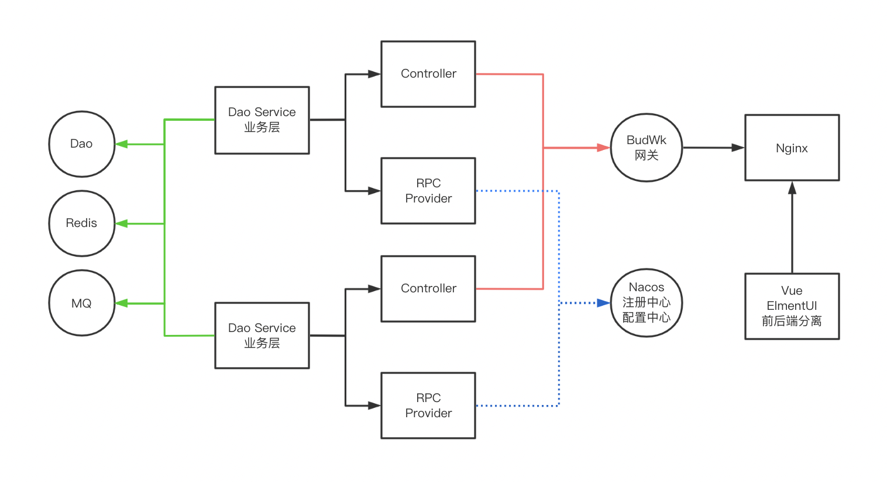

<div align="center">
    <br/>
    <h1>BudWk Open Source Enterprise Java Web Development Framework</h1>

[](https://gitee.com/wizzer/NutzWk)
[](https://github.com/budwk/budwk/releases)
[](LICENSE)
[](https://github.com/nutzam/nutz)
</div>

<div align="center">

**[Official Website](https://budwk.com)** |
**[V8 Demo](https://demo.budwk.com)** |
**[Donation List](https://budwk.com/donation)** 
</div>

<div align="right">
Language: <a href="README.md">中文</a> | English
<br>
<br>

</div>

> Maximize the productivity of Web developers to the greatest extent possible

* QQ Group 1: 68428921 (Full)
* QQ Group 2: 24457628

# 🚀 Introduction

BudWk, originally named NutzWk, is an open-source Java enterprise-level Web development framework based on the domestic framework nutzboot. It has more than ten years a decade of open-source history, has accumulated a large number of enterprise and individual users, and has gone through several iterations from V1 to V8.

V8 further upgrades and transforms the front-end and back-end functions on the basis of API gateway, component library, authentication center, control center, and other functions available in V7, improving user experience while greatly reducing development workload, improving development efficiency, and providing great convenience for product upgrades and iterations.

The framework provides both "microservice single application" and "microservice distributed" versions to choose from. The backend integrates the most commonly used functions such as permission system, system parameters, data dictionary, in-site messages, scheduled tasks, CMS, WeChat, etc., making it easy to get started, convenient to develop, and flexible to expand, especially suitable for various large, medium, and small customized project requirements.

# 🎉 Version Description (BudWk v8.x)

## Features

* Use a set of annotations to automatically generate OpenAPI3 online documentation, while implementing form parameter validation, achieving multiple benefits and reducing development workload
* Unified exception interception processing, business logic judgment throws exceptions that can be captured and output errors in a friendly manner, eliminating the need for a bunch of if-else judgments
* A set of control class log annotations to easily record operator, operation time, IP, request parameters, response results, supporting extension of different data storage methods
* Quick import and export of Excel files, just define annotations on Pojo classes, supporting key-value parsing, subclass property parsing, custom date formats, etc.
* Vue3 front-end tables support dynamic column selection display, sorting, fixing, and other operations; pagination components have been encapsulated to reduce code volume by 80% compared to Vue2 version
* Rich wk-starter component library makes developing microservice applications as simple as building blocks, and component development is also very easy

## Runtime Environment

*   JDK 11 + or OpenJDK 11 +
*   Redis 6.x +
*   MariaDB 10.x + or MySql 5.7, Oracle, SqlServer, DM, Kingbase, etc.
*   Nacos 2.0.3 +

## Development Tools
*   IntelliJ IDEA
*   Visual Studio Code
*   Node v19/v18 +
*   Maven 3.6.x +
*   Git

## Directory Structure

```
┌ Frontend
│    ├─wk-vue3-admin    Vue3
│    └─wk-vue-admin     Vue2
└─Backend
     ├─wk-starter       Component Library
     ├─wk-mini          Single Application Version
     └─···              Distributed Version
        ├─wk-gateway    API Gateway
        ├─wk-ucenter    User Center 
        ├─wk-platform   Control Center
        ├─wk-cms        Content Management 
        ├─wk-wechat     WeChat Management 
```        

* For the code generator IDEA plugin, please download and install [https://gitee.com/budwk/budwk-codegenerator](https://gitee.com/budwk/budwk-codegenerator)
* It is recommended to create separate Git repositories for component centers, control centers, front-end, and other functional modules for easier permission management and upgrade iterations

## Simple Architecture Diagram (Distributed Version)



## V8 Technology Stack
### Backend Technology
Technology | Name | Website
----|------|----
Nutz | JavaEE Application Framework  | [https://nutzam.com](https://nutzam.com)
NutzBoot | Microservice Framework  | [https://github.com/nutzam/nutzboot](https://github.com/nutzam/nutzboot)
SaToken | Authorization Framework  | [http://sa-token.dev33.cn](http://sa-token.dev33.cn)
Druid | Database Connection Pool  | [https://github.com/alibaba/druid](https://github.com/alibaba/druid)
Nacos | Configuration and Registration Center  | [https://nacos.io](https://nacos.io)
Dubbo | Distributed Service Framework  | [https://dubbo.apache.org](https://dubbo.apache.org)
Redis | Distributed Cache Database  | [https://redis.io](https://redis.io)
Quartz | Job Scheduling Framework  | [https://www.quartz-scheduler.org](https://www.quartz-scheduler.org)
IdGenerator | Snowflake Primary Key Generation  | [https://github.com/yitter/IdGenerator](https://github.com/yitter/IdGenerator)
Hutool | Utility Collection  | [https://hutool.cn](https://hutool.cn)

### Vue3 Frontend Technology
Technology | Name | Website
----|------|----
Vue3 | MVVM Framework | [https://vuejs.org](https://vuejs.org)
Vite | Application Framework | [https://vitejs.dev](https://vitejs.dev)
Element-Plus | UI Framework Based on Vue3 | [https://element-plus.gitee.io/en-US](https://element-plus.gitee.io/en-US/)
Font-awesome | Font Icons  | [https://fontawesome.com](https://fontawesome.com)

## Simple Development Guide

### Java Backend
*   Ensure MySql, Redis, Nacos default port configuration and have been started
*   Create an empty database named `budwk_v8` in MySql, tables will be automatically created when each microservice module starts, and data will be initialized at the same time
*   Execute `mvn compile nutzboot:run` to run or `mvn package nutzboot:shade` to generate an executable jar package in a single NB module
*   Execute `mvn -Dmaven.javadoc.skip=true -Dmaven.test.skip=true -Dnutzboot.dst=E:/dst clean package nutzboot:shade` in the backend project root directory to generate all runnable jar packages to the specified location
*   Start jar files separately `nohup java -jar budwk.jar >/dev/null 2>&1 &`
*   After normal startup of the frontend, access `http://127.0.0.1:8800` with username superadmin and password 1
*   API debugging `http://127.0.0.1:9900/platform/openapi` `http://127.0.0.1:9900/ucenter/openapi` etc. 
*   The API debugging path for wk-mini single application version is `http://127.0.0.1:9900/openapi`
*   Add `--nutz.profiles.active=dev` to IDEA command line parameters to specify loading the `application-dev.yaml` configuration file

### Vue3 Frontend (wk-vue3-admin)

* `npm install pnpm`
* `pnpm install`
* `pnpm run dev`

## Detailed Development Guide

[https://budwk.com](https://budwk.com)

## Server Deployment

### Running jar

*   Run with configuration file specified in jar `nohup java -jar -Dnutz.profiles.active=pro -Xmx450m wk-mini.jar >/dev/null 2>&1 &`
*   Run with configuration file loaded from folder `nohup java -jar -Dnutz.boot.configure.yaml.dir=/data/budwk/ -Xmx450m wk-mini.jar >/dev/null 2>&1 &`

### Docker Deployment Example

`wk-gateway`

* Compile executable jar `mvn clean package nutzboot:shade`

* Build docker image `docker build -t wizzer/budwk-wk-gateway:v8.1.0 . --platform linux/amd64`

`wk-platform`

* Compile executable jar `mvn clean package nutzboot:shade`

* Build docker image `docker build -t wizzer/budwk-wk-platform:v8.1.0 . --platform linux/amd64`

`wk-ucenter`

* Compile executable jar `mvn clean package nutzboot:shade`

* Build docker image `docker build -t wizzer/budwk-wk-ucenter:v8.1.0 . --platform linux/amd64`

Other NB modules are omitted... then mount the `/conf` path and place the configuration file `application.yaml` properly

# 🤝 Acknowledgements

*   [@wendal](https://github.com/wendal) Code contributor, main author of Nutz/LuatOS
*   [@rekoe](https://github.com/Rekoe) Code contributor
*   [@enilu](https://github.com/enilu) IDEA plugin code contributor
*   [@threefish](https://github.com/threefish) IDEA plugin code contributor
*   [@loyalove](https://github.com/loyalove) Frontend code contributor
*   [@syrxw](https://github.com/syrxw) Frontend code contributor

<br/>

> If you think it's good, please click a star in the upper right corner, help forward, thank you 🙏🙏🙏 Everyone's support is the biggest motivation for open source 